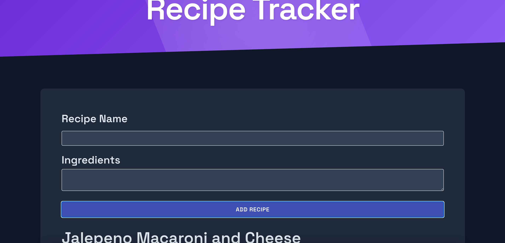

# CulinaryKeeper

An expansive recipe tracker application built with the following tech stack. Start saving those unique recipes!!

## Tech Stack

* **Frontend:**
    * React: JavaScript library for building user interfaces.
    * HTML: Markup language for structuring the content.
    * CSS: Styling language for the visual presentation.
    * JavaScript: Programming language for the application logic.
* **Development Tools:**
    * Node.js: JavaScript runtime environment.
    * npm or yarn: Package managers for installing dependencies.
    * create-react-app: Tool for setting up a new React project.
    * ESLint: Linting tool for code quality and style checking (optional, but recommended).
    * Git: Version control system for tracking changes.
## Sample Image

## Features

* Add new recipes with title, ingredients, and instructions.
* Edit existing recipes.
* Delete recipes.
* Search for recipes by name or ingredients.
* View recipe details in a modal.
* Responsive design for various screen sizes.

## Installation

1. Clone the repository: `git clone https://github.com/Freedomwithin/CulinaryKeeper.git`
2. Install dependencies: `yarn install` or `npm install`

## Usage

1. Start the development server: `yarn start` or `npm start`
2. Open your browser and go to `http://localhost:3000`

## Contributing

Contributions are welcome! Please feel free to submit issues or pull requests.

## License

This project is licensed under the MIT License - see the [LICENSE](LICENSE) file for details.

